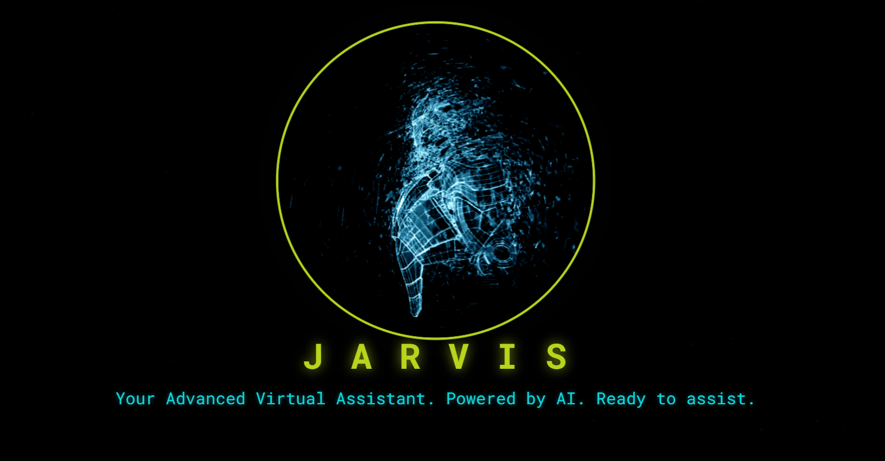
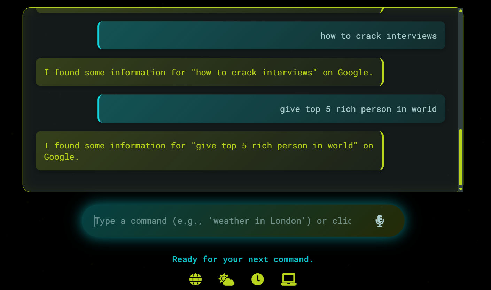

# 🎙️ JARVIS - Web-Based Virtual Assistant






**JARVIS** is a responsive, interactive, web-based virtual assistant inspired by Iron Man.  
It supports voice commands and text input to perform tasks like web searches, weather checks, time/date queries, and more. The interface features a cyberpunk theme with animated effects and chat history. Runs entirely in the browser—no backend required.

---

## 🚀 Features
- Voice recognition via Web Speech API  
- Speech synthesis for AI responses  
- Greets user according to time  
- Opens websites like Google, YouTube, Wikipedia, Facebook  
- Answers “What is… / Who is…” questions  
- Displays listening state on UI  
- Chat history for previous commands  
- Fully responsive and browser-based  

---

## 🧩 Technologies Used
- **HTML5** — Structure of the app  
- **CSS3** — Styling, layout, animations  
- **JavaScript (Vanilla)** — Voice commands, logic, responses  
- **Web Speech API** — Speech recognition and synthesis  

---

## ▶️ How to Run
1. Clone this repository:
   ```bash
   git clone https://github.com/sahilsangle24/Jarvis-AI-Web.git
